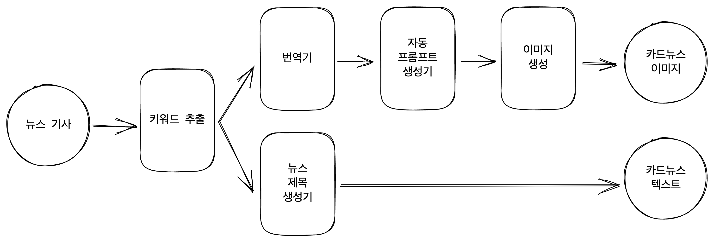

# One-line-news
짧디 짧은 인터넷 기사도 읽기 어려운 바쁜 현대인들을 위한
예쁜 카드 뉴스 생성기

## Dependency
python version : 3.10.10 
(다른 건 테스트를 안해 봤습니다.)

## Install
```bash
git clone https://github.com/htkim27/one-line-news.git
conda create -n one-line
conda activate one-line
pip install -r requirements.txt
```

[Optional]
```bash
pip install xformers
```

## Run
```bash
python one_line_card_news.py
```


## Architecture


## Gradio (Temp)
https://9c85a008612a7993bc.gradio.live/ (On)

## Hugging Face Model
- 한 줄 뉴스 생성기 : https://huggingface.co/htkim27/one-line-news
- 자동 프롬프트 생성기 : https://huggingface.co/FredZhang7/distilgpt2-stable-diffusion-v2
- STABLE_DIFFUSION : https://huggingface.co/stabilityai/stable-diffusion-2-1

## Examples
- 원하던 모습 😊


- 실제 예시 ㅠ


## Reference
ployglot-ko-1.3b : https://huggingface.co/EleutherAI/polyglot-ko-1.3b
KoAlpaca - github : https://github.com/Beomi/KoAlpaca
treform - github : https://github.com/MinSong2/treform